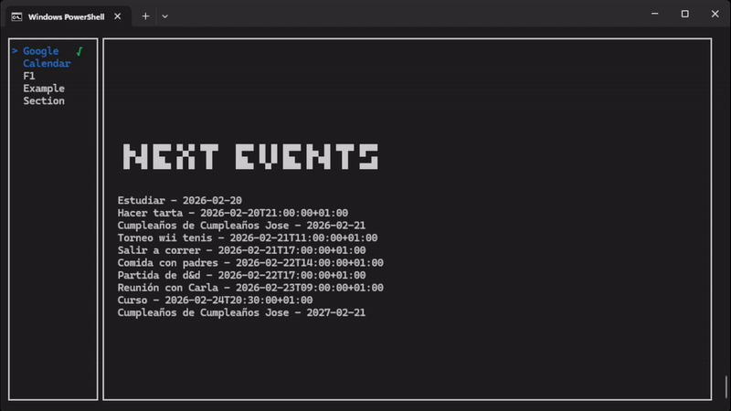

# Teletext

A terminal-based dashboard application that displays personalized information in modules, similar to old-school TV teletext services. Built with React and Ink for a rich CLI experience.



## Features

- **Modular Architecture** - Add custom sections via plugins
- **Built-in Sections:**
  - Google Calendar integration
  - F1 Race information
- **Keyboard Navigation** - Navigate sections with arrow keys
- **Caching** - Built-in caching for improved performance

## Requirements

- Node.js >= 16
- Google api key for calendar

## Installation

```bash
# Clone the repository
git clone https://github.com/Torodin/teletext.git
cd teletext

# Install dependencies
npm install

# Build the project
npm run build
```

## Usage

```bash
# Run the CLI
npx teletext

# Or run in development mode to use chrome dev tools
npm run debug
```

## Configuration

### Google Calendar

To enable Google Calendar integration:

1. Go to the [Google Cloud Console](https://console.cloud.google.com/)
2. Create a new project and enable the Google Calendar API
3. Create OAuth 2.0 credentials and download them as `google_credentials.json`
4. Place the credentials file in the project root

On first run, a browser window will open for authentication.

## Keybindings

| Key       | Action            |
| --------- | ----------------- |
| `↑` / `↓` | Navigate sections |
| `q`       | Quit application  |
| `Esc`     | Quit application  |

## Plugins

Create custom sections by building plugins:

```typescript
import React from 'react';
import SectionProps from '../../source/common/sectionprops';

export default {
	sectionName: 'My Section',
	sectionKey: 'my_section',
	render: ({maxLength}: SectionProps) => {
		return (
			<Box flexDirection="column">
				<Text>Your custom content here</Text>
			</Box>
		);
	},
};
```

Place compiled plugins in `dist/plugins/`. The app will automatically load them on startup.

## License

MIT
